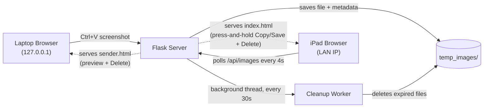

# Temporary Notes Bridge

A self-hosted, LAN-based image relay that bridges a laptop and a tablet for fast, clutter-free note-taking. Screenshots are pasted or dragged in on one device, appear on the other within seconds, and are automatically deleted after a configurable expiration window — no manual cleanup, no storage buildup.

## Why I built this

While studying SQL on my laptop (YouTube, ChatGPT) and taking notes on my iPad, transcribing diagrams and tables by hand was slow, and taking photos of the screen produced low-quality, unsearchable notes. I needed a way to move a screenshot from laptop to iPad in seconds, without permanently cluttering either device's storage with images I only need for a few minutes.

## Features

- **QR code for instant iPad connection** — the sender page shows a scannable QR code (generated client-side, encoding the server's own LAN address) so you never have to type or re-type an IP address on the iPad
- **Two views from one server** — the same Flask app serves a different interface depending on how it's accessed: opening it via `127.0.0.1` (the laptop itself) shows a minimal sender view; opening it via the LAN IP (e.g. from an iPad) shows the full receiver view
- **Clipboard paste-to-upload** — press Ctrl+V after a screenshot; no file dialogs needed
- **Drag-and-drop and manual file upload** as fallback input methods
- **Automatic time-based expiration** — each image is deleted from the server a configurable number of hours after upload (default: 5)
- **Background cleanup worker** — a daemon thread sweeps expired images every 30 seconds, independent of client activity
- **Live sync across devices** — a lightweight polling loop keeps every connected device's view in sync within ~4 seconds, with cache-control headers to defeat aggressive mobile browser caching (a real issue on iOS Safari)
- **Press-and-hold Copy/Save on the receiver view** — since iOS Safari blocks clipboard-write buttons over plain HTTP, the full-size photo itself is directly long-press-able, triggering the native iOS "Copy / Save to Photos" menu with no extra tap
- **Zero external dependencies for storage** — flat-file JSON metadata store, no database required

## Two views, one server

Flask prints two addresses on startup: `http://127.0.0.1:5000` and `http://<lan-ip>:5000`. The server inspects the request's origin (`request.remote_addr`) to decide which page to serve:

| Accessed via | Device | Page served | Shows |
|---|---|---|---|
| `127.0.0.1:5000` | Laptop (loopback) | `sender.html` | Paste box, QR code, full-size preview of what was sent, expiry countdown, Delete |
| `<lan-ip>:5000` | Any other device (e.g. iPad) | `index.html` | Same, but the photo is directly press-and-hold-able for native Copy/Save |

The laptop doesn't need press-and-hold Copy/Save since the original screenshot already exists on its own disk/clipboard — it only needs to confirm the right image was sent and be able to delete a mistake.

## Architecture



**Flow:** Image is copied on the laptop → pasted into the browser tab (opened via `127.0.0.1`) → uploaded via `multipart/form-data` to Flask → saved to disk with a timestamped expiry recorded in `metadata.json` → any device polling the same server (e.g. the iPad, connected via the LAN IP) picks it up automatically → a background thread purges it once its expiry passes.

## Tech Stack

| Layer | Technology |
|---|---|
| Backend | Python, Flask |
| Storage | Flat-file JSON metadata + local filesystem |
| Concurrency | Python `threading` (background expiration worker) |
| Frontend | Vanilla JavaScript, Clipboard API, Fetch API |
| Networking | Local network (LAN), no cloud dependency |

## Project Structure

```
temporary-notes-bridge/
├── server.py              # Flask app, routes, background cleanup thread
├── config.py               # Expiration window, storage path
├── requirements.txt
├── app/
│   ├── storage.py          # File save/copy logic
│   ├── metadata.py         # Expiry tracking (JSON store)
│   └── cleanup.py          # Expired-file deletion logic
├── templates/
│   ├── index.html           # Receiver UI (press-and-hold Copy/Save + Delete) — served to non-loopback devices
│   └── sender.html          # Sender UI (preview + Delete only) — served on 127.0.0.1
└── temp_images/             # Runtime image storage (empty in repo)
```

## Setup

```bash
git clone <this-repo>
cd temporary-notes-bridge
pip install -r requirements.txt
python server.py
```

The server starts on port 5000 and binds to all network interfaces (`0.0.0.0`), so any device on the same Wi-Fi network can reach it via the host machine's local IP address (e.g. `http://192.168.1.42:5000`).

## Configuration

Edit `config.py`:

```python
EXPIRATION_HOURS = 5   # how long an image survives before auto-deletion
```

## Possible Future Improvements

- HTTPS via a self-signed cert or reverse proxy (unlocks the full Clipboard API on more browsers)
- Progressive Web App manifest for a native-app-like icon on iOS home screen
- Optional password/token gate for the upload endpoint
- Watch-folder mode to auto-upload new screenshots without any manual paste step

## Running silently at Windows login

`start-silent.bat` launches the server with `pythonw` (no visible console window). To have it start automatically every time you log into Windows:

1. Press `Win + R`, type `shell:startup`, press Enter
2. Right-click inside the folder that opens → **New → Shortcut**
3. Browse to `start-silent.bat` in this project folder, select it, click Next, then Finish

The server will now start invisibly on every login. To stop it, open Task Manager and end the `pythonw.exe` process.

---

### Resume bullet points (pick 2–3)

- Built a full-stack local network utility (Flask + vanilla JS) enabling real-time image transfer between devices with automatic time-based expiration, using a background worker thread for cleanup and a flat-file metadata store for state
- Implemented request-origin-based view routing, serving distinct interfaces from a single Flask endpoint depending on whether the client is the host device (loopback) or a remote device on the LAN
- Added a self-discovering QR code connection flow, using a socket-based LAN IP lookup (no external service dependency) surfaced through a small API endpoint and rendered client-side
- Diagnosed and resolved a mobile Safari caching bug causing stale data across polling clients, by implementing HTTP cache-control headers and client-side cache-busting
- Designed a RESTful API with upload, list, delete, and file-serving endpoints, consumed by a vanilla JS frontend using the Clipboard and Fetch APIs